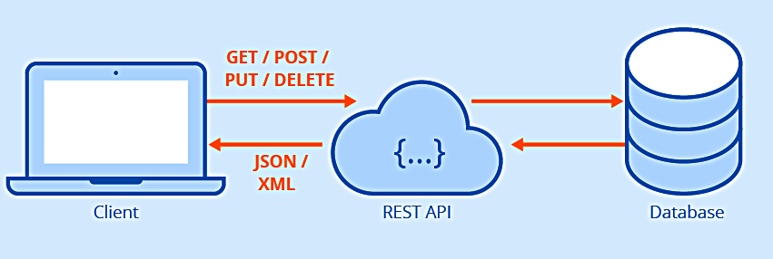

# PERN-TODO

## An Overview Postgres

### Install pg cors such that we can iteract with postgeres.

```bash
npm i express pg cors
```

- To create a database

```SQL
CREATE DATABASE perntodo;
```

- To connect to the perntodo

```sql
\c perntodo
```

- Create table

```sql
CREATE TABLE todo(
    todo_id SERIAL PRIMARY KEY,
    description VARCHAR(255),
);
```

## What is API ?

API is the acronym for "Application Programming Interface". It is a software that allows two applications to communicate with each other over the internet and through various devices. Every time you access an app like Facebook or check the weather on your smartphone, an API is used.

## What is REST ?

REST is acronym for **RE**presentational **S**tate **T**ransfer. It is architectural style for **distributed hypermedia systems** and was first presented by Roy Fielding in 2000.



A RESTful API is an architectural style for an application program interface (API) that uses HTTP requests to access and use data. That data can be used to GET, PUT, POST and DELETE data types, which refers to the reading, updating, creating and deleting of operations concerning resources.

It is based on six principles that describe how networked resources are defined and addressed on the web, for example in a cloud.

## The six principles of REST

1. ### Client-server architecture

   The principle behind the client-server architecture is the separation of problems. Dividing the user interface from data storage improves the portability of that interface across multiple platforms. It also has the advantage that different components can be developed independently from each other.

2. ### Statelessness

   Statelessness means that the communication between client and server always contains all the information needed to execute the request. There is no session state on the server, it is kept entirely on the client. If access to a resource requires authentication, the client must authenticate itself on each request.

3. ### Caching

   The client, server, and any intermediate components can cache all resources to improve performance. The information can be classified as cacheable or non-cacheable.

4. ### Uniform interface

   All components of a RESTful API have to follow the same rules to communicate with each other. This also makes it easier to understand interactions between the various components of a system.

5. ### Layered system

   Individual components cannot see beyond the immediate level they interact with. This means that a client that connects to an intermediate component such as a proxy does not know what is behind it. Therefore, components can be easily exchanged or expanded independently of each other.

6. ### Code-on-demand
   Additional code can be downloaded to extend client functionality. However, this is optional because the client may not be able to download or execute this code.

## Advantage of REST for Development of an API

- The complete separation of the user interface from server and data storage offers some advantages for the development of an API.

  - it improves the portability of the interface to other types of platforms, increases project scalability and allows different components to be developed independently.
  - Developers can easily migrate to other servers or make changes to the database, provided the data is sent correctly from each request.
  - The separation thus increases overall flexibility in development.

- A REST API is always independent of the type of platform or languages used, it adapts to the type of syntax or platform used. This provides great freedom when changing or testing new environments within a development.
  - You can use PHP, Java, Python or Node.js servers with a REST API. Only responses to requests must be in the language used for information exchange, usually XML or JSON.
